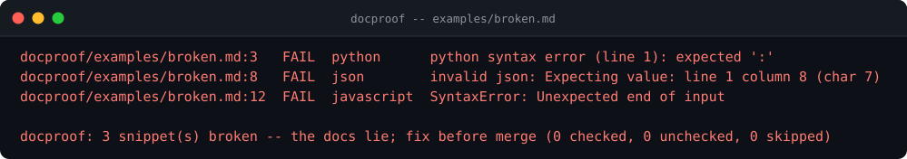
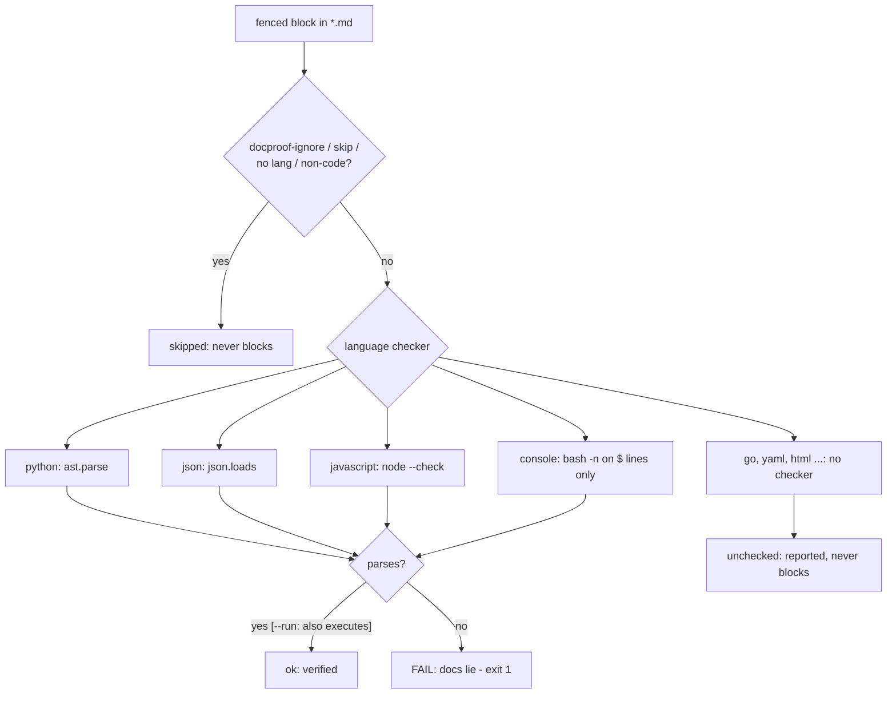

# docproof

**Documentation rots silently - `docproof` makes it a build status.** Every fenced code block in your Markdown gets a deterministic checker: python parses with `ast`, json with `json.loads`, javascript with `node --check`, shell with `bash -n` (console sessions: the `$ `-lines only). Snippet broken = the docs lie = exit 1. No model reads your docs, no network, no telemetry.

[](https://github.com/F0Rextasy/docproof/actions/workflows/test.yml)
[](https://www.python.org/)
[](#what-it-will-never-do)
[](https://skills.sh/F0Rextasy/docproof)
[](LICENSE)



## Why this exists

The API got renamed eight months ago. The README still shows the old call, the snippet still *looks* plausible, and the next person to copy-paste it loses an afternoon debugging their own code that was never wrong. Docs rot is invisible until a stranger trips on it - and "just ask an LLM to check" is slow, non-deterministic, and ships your source to a prompt. Parsing is a solved problem: this is regex-and-AST work that belongs in CI, in milliseconds, next to your linter.

## Quick start

```bash
# install the skill into any agent (Claude Code, Codex, Cursor, OpenCode, ...):
npx skills add F0Rextasy/docproof

# or run it directly:
git clone https://github.com/F0Rextasy/docproof
python docproof/scripts/docproof README.md docs/ --strict
```

| Exit | Meaning |
| --- | --- |
| `0` | every checkable snippet verified (warnings ok unless `--strict`) |
| `1` | a snippet is broken - the docs lie, fix before merge |
| `2` | usage error |

Parse-only by default; `--run` opts python/bash snippets into a timed execution (`--timeout`, default 10s) to catch code that parses but explodes. `--format json` for machines.

## How a block is judged



**Console sessions are special:** only `$ `-prompted lines are commands; output lines are ignored, so a session may print anything (pseudo-code, stray parens) without failing. And console blocks are **never executed, even under `--run`** - real sessions carry `pip install` and `rm`. Missing checker binary (no node, WSL-stub bash) is a **warning**, never a guessed verdict. Full catalogue: [references/RULES.md](references/RULES.md).

## Evidence (real output)

`examples/broken.md` lies three ways - one broken python block, one invalid json block, one truncated javascript block:

```console
$ python scripts/docproof examples/broken.md --no-color
docproof/examples/broken.md:3   FAIL  python      python syntax error (line 1): expected ':'
docproof/examples/broken.md:8   FAIL  json        invalid json: Expecting value: line 1 column 8 (char 7)
docproof/examples/broken.md:12  FAIL  javascript  SyntaxError: Unexpected end of input

docproof: 3 snippet(s) broken -- the docs lie; fix before merge (0 checked, 0 unchecked, 0 skipped)
[exit 1]
```

`examples/good.md` - python, json, javascript, a console session with junk output lines, a `go` block (unchecked), a `text` block and a `python skip` block (skipped) - exits 0. Contract tests, 9 for 9:

```console
$ python -m unittest discover -s tests -v
.........
----------------------------------------------------------------------
Ran 9 tests in 1.415s

OK
[exit 0]
```

Opting a genuinely non-runnable block out, in place:

````markdown
<!-- docproof-ignore -->
```python
example-only pseudocode
```
````

(or put `skip` in the info string: ```` ```python skip ````).

## Verdict levels

| Level | Meaning | Blocks? |
| --- | --- | --- |
| `fail` | snippet broken (syntax / bad json / runtime under `--run`) | always |
| `warn` | checker binary missing or unusable - unverified | `--strict` |
| `unchecked` | language has no checker (go, yaml, ...) | never |
| `skipped` | opted out (`skip`, ignore comment, non-code) | never |

Honesty invariant: docproof reports what it could not verify instead of pretending it did - `unchecked`/`skipped` never turn red.

## Wire it into CI

```yaml
- uses: actions/checkout@v4
- uses: actions/setup-python@v5
  with:
    python-version: "3.12"
- name: docs tell the truth
  run: python docproof/scripts/docproof README.md docs/ --strict
```

This repository dogfoods it: CI runs docproof over its own `README.md`, `SKILL.md`, and `references/` on every push - and asserts `examples/broken.md` still fails.

## What it will never do

- Execute anything without `--run` - and console sessions never, ever run.
- Paste docs into a model to "check" them - that is this repo's whole reason to exist.
- Mark a broken snippet skipped to go green - skips are for non-runnable blocks, and they are counted in the summary.

## The family

Deterministic gates - one Python script each, stdlib (+ optional node/bash checkers), same exit contract:

| Gate | Catches |
| --- | --- |
| [preflight](https://github.com/F0Rextasy/preflight) | committed `.env`, weak secrets, debug-in-prod, wildcard CORS |
| [bandaid](https://github.com/F0Rextasy/bandaid) | symptom-suppression patches: swallowed errors, disabled tests, removed guards |
| [prove-it](https://github.com/F0Rextasy/prove-it) | claims with no executed evidence behind them |
| [testgate](https://github.com/F0Rextasy/testgate) | tests that can never fail |
| [shipcheck](https://github.com/F0Rextasy/shipcheck) | broken, unimportable, or stale release artifacts |
| [dsh-gate](https://github.com/F0Rextasy/dsh-gate) | red turns closing green in DeepSeek Harness |
| [ci-triage](https://github.com/F0Rextasy/ci-triage) | red CI triaged without an LLM |
| **docproof** (this repo) | documentation snippets that no longer parse or run |

## License

[MIT](LICENSE)
